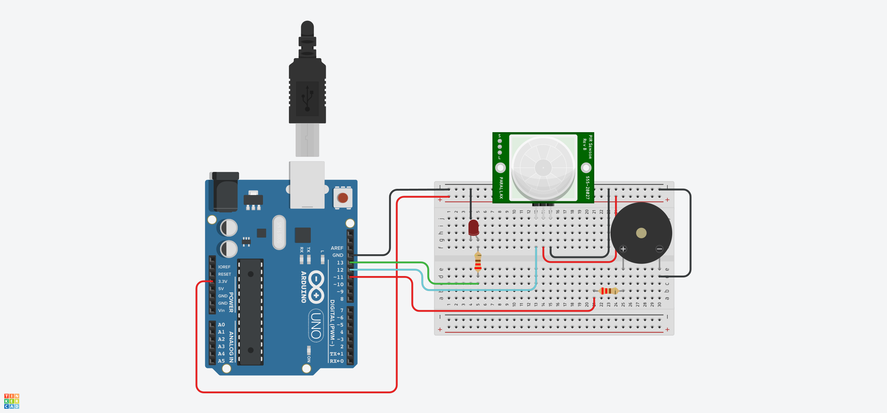

# Projeto Arduíno para manipular um detector de presença incluindo um led e um buzzer

## Contextualização

Neste experimento fiz com que o arduíno manipulasse um detector de presença, sendo que ao detectar o movimento um LED acenderá e o buzzer emitirá um som. 

## Lista de componentes:

- Arduíno UNO R3
- Um cabo de conexão USB
- Placa de prototipação (Protoboard)
- Detector de movimento (PIR - Passive Infrared Sensor, ou Sensor Infravermelho Passivo)
- LED
- Resistor de 220 Ω ohms
- Jumpers (macho-macho)
- Buzzer passivo

## Esquema do projeto

## Projeto no Tinkercad

https://www.tinkercad.com/things/eIEK5suRxR5
